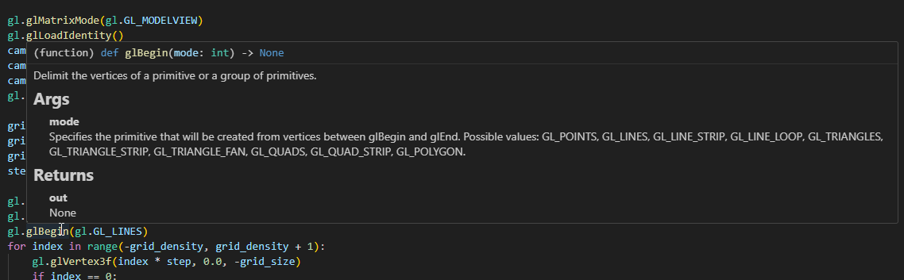

# PyOpenGL GL Stubs

Detailed Python stubs for the GL library of PyOpenGL.

## Overview

`pyopengl_gl_stubs` provides type stubs for the OpenGL.GL bindings in the PyOpenGL library. These stubs are designed to improve developer productivity when working in Python.

## Features

- **Detailed Type Annotations**: Includes definitions for OpenGL functions and constants.

## Example

## Contributing

If you find missing or incorrect type definitions, let me know.

